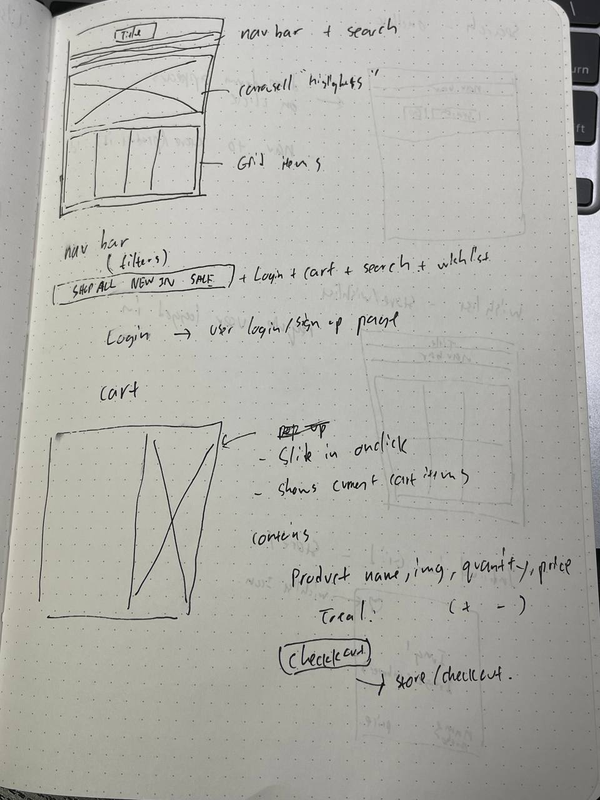
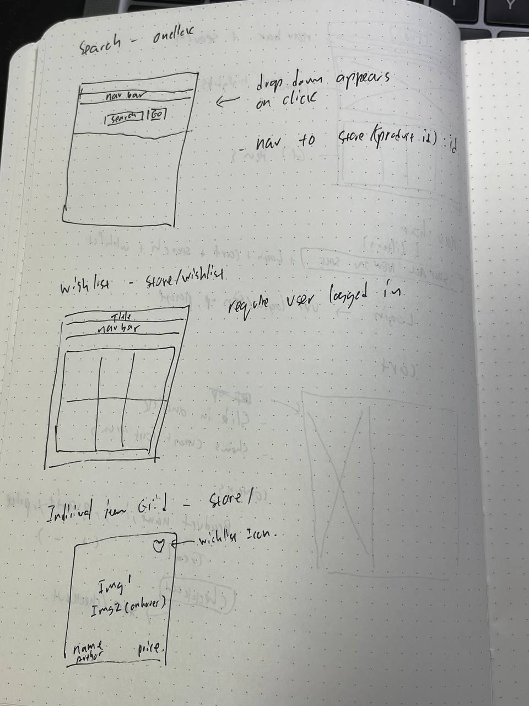

# Photobook Online Shop

A rebuild of DECK's online photobook store

## Getting Started

## Context

This app is a MERN online eshop rebuild referencing stackedhome's online store for the UI : https://stackedhomes.com/store/

The app features full CRUD functionality for adding and editing product information. The primary focus is the cart feature that interacts with the user adding items into their cart and having the information updated at the same instance while they are on the browsing page.

## Wireframe

