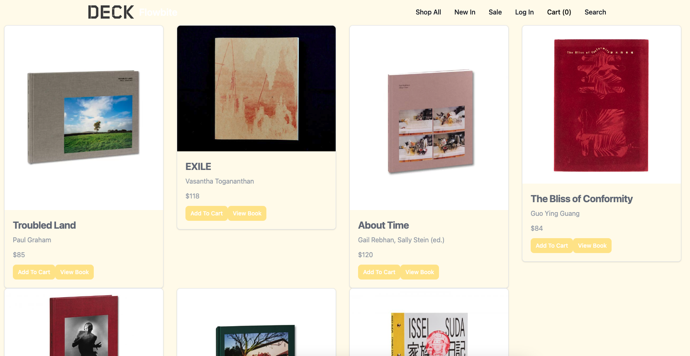
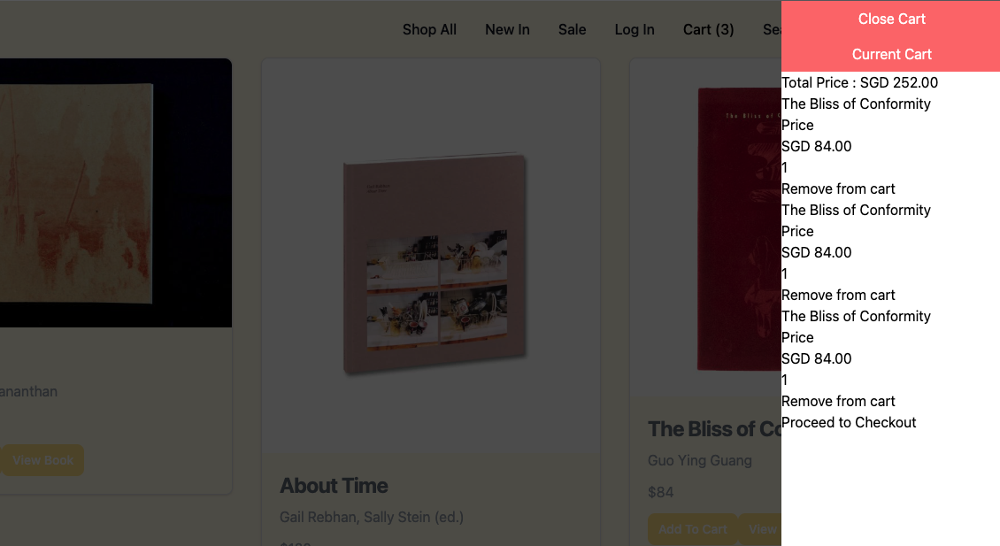
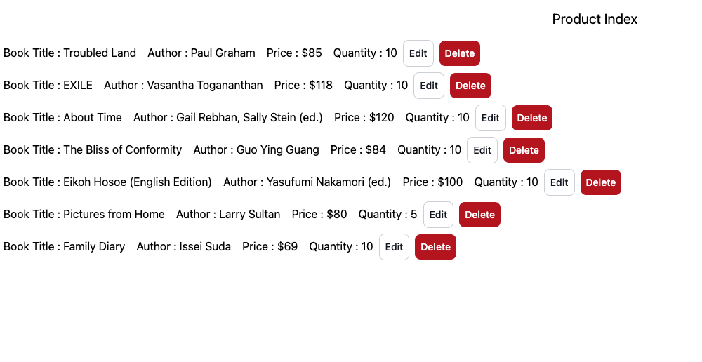

# Photobook Online Shop

A rebuild of DECK's online photobook store , to view please click the link here : https://wide-eyed-yak-jewelry.cyclic.app

## Getting Started

## Context

This app is a MERN online eshop rebuild referencing stackedhome's online store for the UI : https://stackedhomes.com/store/

The app features full CRUD functionality for adding and editing product information. The app features a working UI for the Cart interaction where the cart items are updated constantly and are retrievable when you browse between the pages.

As an Admin, you are able to enter new items and tag them in the categories Sale or New In to have them featured on the nav bar shortcut. Similarly you will have the full CRUD feature on every item.

As a User, when logged in, you will be able to tag items as favourites and have them saved into your favourites bar.

## Models

The app consists of the users with two roles, either admin or user and the product model that is referenced in the user model for the "favourites" function.

For future development, there will be a user cart and line item model. This is to complete the cart functionality where a new cart is referenced to the user, and the line items will be pushed into the cart entry.

## Screenshots







## Techonoliges Used

- MERN STACK (MongoDb, Express, ReactJS, NodeJs)
- useReducer/useContext for React
- Tailwind CSS

## Key Development Considerations

### State management for Cart UI

The cart UI has to be hold a state globally throughout the app as the user would want to keep track of the items in the items as they are browsing through the various sorting pages or individual item views. Therefore useReducer and useContext was used for state management for easy access when generating the routes.

The app was wrapped in the cart provider in the main app jsx.

main.jsx

```javascript
ReactDOM.createRoot(document.getElementById("root")).render(
  <React.StrictMode>
    <CartProvider>
      <App />
    </CartProvider>
  </React.StrictMode>
);
```

Cart.jsx - Cart Component

```javascript
const CartStateContext = createContext();
const CartDispatchContext = createContext();

const reducer = (state, action) => {
  switch (action.type) {
    case "ADD":
      return [...state, { ...action.item, quantity: 1 }];

    case "REMOVE":
      const newArr = [...state];
      newArr.splice(action.index, 1);
      return newArr;

    case "UPDATE_QUANTITY":
      const updatedArr = [...state];
      const index = updatedArr.findIndex((item) => item.id === action.itemId);
      if (index >= 0) {
        updatedArr[index].quantity = action.quantity;
      }
      return updatedArr;

    default:
      throw new Error(`unknown action ${action.type}`);
  }
};

export const CartProvider = ({ children }) => {
  const [state, dispatch] = useReducer(reducer, []);
  return (
    <CartDispatchContext.Provider value={dispatch}>
      <CartStateContext.Provider value={state}>
        {children}
      </CartStateContext.Provider>
    </CartDispatchContext.Provider>
  );
};

export const useCart = () => useContext(CartStateContext);
export const useDispatchCart = () => useContext(CartDispatchContext);
```

### Auth routes for user/admin as well as buttons that are activated when user is logged in:

The user role can be modified within the database to assign the user as an user or admin. Their access to pages are then controlled through React routes with a ternary operator :

App.jsx

```javascript
<Route
  path="/admin"
  element={
    user && user.userRole == "admin" ? <ProdMgmt /> : <AccessDeniedMsg />
  }
/>
```

In this example the props to check if a JWT token is present is passed down to "user". This operator checks if a user is logged in and then activates the favourite button to be accessed.

ProductSingle.jsx

```javascript
{
  user ? (
    <button
      onClick={() => addFavouriteBook(book._id)}
      className="inline-flex items-center px-3 py-2 text-sm font-medium text-center text-white bg-orange-400 rounded-lg hover:bg-orange-500 focus:ring-4 focus:outline-none focus:ring-orange-300"
    >
      Add to Favourites
    </button>
  ) : (
    <></>
  );
}
```

## To Be Developed

- The backend of the Cart App linking the order model to the user
- Improving the interface with Tailwind to make the visuals more consistent with class groups
